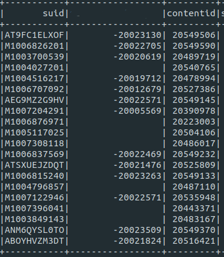
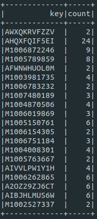
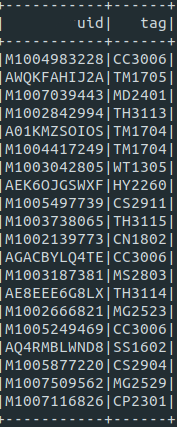
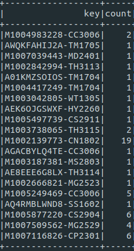
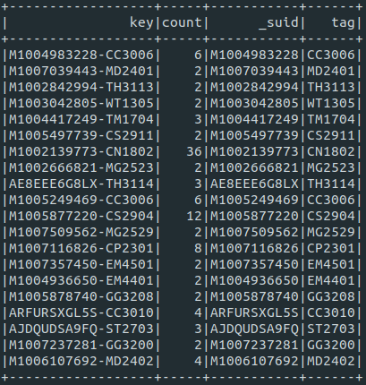

안녕하세요. 현재 국내 메이저 음악 스트리밍 서비스를 제공하는 회사에서 외주를 맡아 3달동안 추천시스템을 개발하며 겪었던 문제들, 그리고 해결 방법들을 하나하나 정리해 나가려고 합니다. 3달이라는 시간이 그리 길지 않은 시간이라 생각되지만, 그동안 어떻게 마주쳤던 문제들을 해결해 나갔는지 글로 작성해보려고 합니다.

언제나 그렇듯 프로젝트에는 데드라인이 있기  때문에 충분한 자료 조사 시간이 없었던 상황이라, 훨씬 더 나은 방법이 있을수도, 미봉책에 불과한 대처 방법도 있을 수 있습니다. 심지어 안티 패턴을 사용 했을 수도 있을거 같긴하지만, 어떻게 데드라인 기한에 맞춰 개발을 했는지를 중점적으로 봐주시면 감사하겠습니다.

이를 감안해 봐주시면 감사하겠습니다 :)

틀린 내용이나 보완점이 있다면 말씀해주시면 감사하겠습니다.

그러면 1편을 시작해 보도록 하겠습니다 ㅎㅎ

## E01 - GroupBy,  생각 보다도 비용이 너무나도 비쌌다.

프로젝트 초기에 개발을 진행하는 동안에는, 실데이터가 아닌 테스트용 데이터로 작업을 진행하였고 이는 1개월치 로그 데이터 밖에 없었습니다.

Spark를 처음 접해 리서치를 해가며 작업을 시작했던 터라 스파크를 사용하면 어떤 연산이든 상관없이 알아서 스케일에 대한 부분은 커버해줄거라 막연히 믿고 있었던 저였습니다. 한달치 데이터가 문제없이 돌아간다면, 6개월치는 물론 1년,2년 데이터 연산에 대해서도 돌거라 생각했었죠.

물론 개발용 Standardalone 환경에서는 전혀 문제없이 1년치 데이터에 대해서도 연산이 가능했었습니다.

이러한 안일한 마음가짐으로 Testbad용 서버에 클러스터 환경에서 소스를 올리고 코드를 실행하였습니다. 

그런데.. 네... 맞습니다...
3분도 안되 뻗어버리는 코드... 무지막지한 에러를 쏟아 내는 검은 화면들과 마주해야만 했었습니다...

첫번째로 마주한 에러는 OutOfMemoryError 입니다. 스파크에서 가장 흔하게 일어난다는 오류로, 그만큼 많은 유발원인 들이 있는 에러입니다.(손쉽게 StackOverFlow의 도움을 받을 수 없다는 뜻)

첫번째 들었던 의문은, 노트북으로 잘만 돌아가던 코드가 왜 오히려 성능빵빵한 클러스터 서버 환경에서는 에러가 나는 걸까 였습니다.

클러스터 환경으로 넘어오면서 Executor들간의 IO가 발생하고, 이는 다른 기기간의 IO가 발생하는 터라 수많은 상세 컨피그 옵션들을 봐줘야만 한답니다.

옵션은 또 왜이리 많은지, Memory가 들어간 옵션만 10개가 넘어가는 듯 했습니다. 

Yarn클러스터가 정말 똑똑해서 모든걸 다 알아서 조절해 줄거라 맹신하던 터였죠.

컨피그 옵션을 모두 조절한다고 해도 잘돌아갈거라는 보장도 없고, 기한은 점점 더 다가와 심한 압박감이 느껴졌습니다. 

그리 길지 않은 개발 경력이지만 그래도 일정 못맞춰본 적은 없다는 자부심에 일하고 있었던 터라 어떻게든 해결 해야 한다는 생각 밖에 없었고 구글 검색을 시작하였습니다.

## Godgle .....

먼저 Spark Document를 살펴 보았는데 아주 단비 같은 글귀가 등장합니다.

GroupBy is very Expensive, highly recommend to avoid.

정확한 문단은 기억이 잘 안나지만, 대충 위와같은 요지의 글이었습니다.

제 소스를 다시보니, GroupBy가 안들어간 로직이 없습니다.... 

유저별로 가장 많이 본 컨텐츠 구하기, 컨테츠 별로 가장 ViewCount가 높은 애들 가지고 오기 등....
당연히 gropuby가 비싼줄은 알았지만, 그만큼 클러스터가 늘었으니 문제 없을거라 생각했었죠.

실마리를 찾았으니 이와 관련해 2차 구글링을 때려봅니다. 마침 같은 문제를 겪은 아주 훌륭한 포스트를 찾게 되었는데, 
리디북스에서 공개한 GroupBy를 ReduceByKey로 대체해 어마어마한 성능 향상을 보았다는 내용이 었습니다. 

특히나 데이터 셋이 큰경우 GroupBy 연산에 할당되는 메모리가 매우 큰 규모로 증가한다는 내용도 있었습니다. 

이제 해결방법을 찾았으니 구현을 시작해보도록 합니다!


## 단일 컬럼 GroupBy를 ReduceBy로 대체하기

먼저 집계연산을 ReduceByKey로 대체해 보겠습니다.
실무에서 Scala가 아닌 Python을 사용했습니다. udf나, DataFrame을 rdd로 바꾸는 작업은 파이썬에서 매우 비효율적인 작업으로 알려져 있습니다. 그러나 그런 측면을 모두 고려하고서도, GroupBy보다 월등한 성능을 보였습니다. Scala에서 같은 작업을 한다면 더욱 더 큰 효과를 볼 거라 예상 됩니다.


```python
def rgroupcount(_df,target_field) :

  to_counting_tuple = lambda x : ( x, 1 )

    return _df.select( col(target_field).alias("keystr") )\
            .rdd.map(to_counting_tuple)\
            .reduceByKey(add)\
            .map(lambda x : ( x[0][0], x[1]) )\
            .toDF()\
            .select( col("_1").alias(target_field), col("_2").alias("count"))
```

위 함수는 데이터 프레임 _df를 받아, target_field에 해당하는 컬럼을 집계합니다. 

그러니까 아래와 같은 데이터프레임을 넣고, target_field를 첫번째 컬럼 이름으로 넣으면,


```python
rgroupcount(df,"suid")
```

Output은 target_field와 이에 대한 카운트 컬럼 2개를 가지는 데이터 프레임을 반환 합니다.



또한 저는 to_counting_tuple 을 따로 파라미터로 받아, key에 대해서 Score로 변경한후 집계 연산을 수행해, 단순 카운트 뿐만 아니라 가중치를 반영한 Score값도 조절할 수 있었습니다. 

예를 들면 ID의 첫자리가 M이면 남자, W이면 여자이고 아이템에 특성에 따라 특정 성별에 더 가중치를 주고 싶을 때는 to_counting_tuple 을 그에 맞게 변형 해주어 실행하면 위 효과를 얻을 수 있습니다.

```python
  def to_counting_tuple_weighted(x) :
    return 0.7 if x[0] == "W" else 0.5
```

## 다중 컬럼 GroupBy를 ReduceBy로 대체하기

이제 하나의 컬럼 기준으로 집계연산을 수행해 봤으니, 두개 이상의 연산에 대해서도 집계를 해보고 싶습니다. 

코드는 아래와 같고, 컨셉은 매우 간단합니다. 대상이 되는 컬럼들을 묶어 하나의 스트링 컬럼으로 만들고 위와 같은 로직을 한번더 적용하면 해결됩니다.

저는 구분자를 대쉬로 했는데 이는 도메인에 따라 절대 포함되지 않을 문자열을 선택해주시면 되겠습니다~

```python

def rgroupcountmultikey(_df,*fields,op=add) :
    self.info("RgroupCountmultikey {}".format(fields))
    cols = reduce(lambda x , y : x + [ col(y) , F.lit("-") ], fields, [])
    cols = cols[:-1]

    return _df.select( F.concat(*cols).alias("keystr") )\
            .rdd.map(to_counting_tuple)\
            .reduceByKey(op)\
            .map(lambda x : ( x[0][0], x[1]) )\
            .toDF().select( col("_1").alias("key"), col("_2").alias("count"))

```

예시로 userid 와 좋아요를 누른 tagid 를 그룹화 해서 집계를 하고 싶다면, 
userid와 tagid를 가진 데이터 프레임을 인풋 데이터로 넣고,



집계를 해봅시다 ! 아래와 같이 호출!
```python
rgroupcountmultikey(_df,"userid","tags")
```

그러면 아래와 같이 나와 주십니다.



key값이 유저아이디와 태그 아이디로 묶여 그에 해당하는 카운트 값을 가지는 것을 확인 할수 있습니다.
그러면 이제 다시 유저 아이디와 태그 아이디를 따로 분리 시키고 싶을 수가 있겠죠? 
네 그래서 제가 또 준비했습니다 ..ㅎㅎ

```python
def splitmultikey(_df,target_field,*fields) :
    fcnt = len(fields) 

    def getkey(i) :
        try :
            return lambda x : x.split("-")[i]
        except Exception as e:
            print("삑! {}".format(e))
            return ""

    objs = list( F.udf(getkey(i),T.StringType() ) for i in range(fcnt) )

    def obj(__df,i) :
        return __df.withColumn( fields[i], objs[i](target_field) )

    return reduce(lambda bdf,i : obj(bdf,i) , range(fcnt),_df)
```

위의 데이터 프레임 key를 대시 기준으로 컬럼 하나씩 따로 분리하기 위해 아래와 같이 호출!

```python
splitmultikey(df,"key","_suid","tagid")
#타겟이 되는 컬럼 이름을 첫번째로 넣어주고, 이에 해당하는 키 이름값들을 차례로 넣어준다,
#대시가 한개 있다면 뒤에 key이름을 2개
#두개 있다면 3개 주면 된다.
```

아래와 같이 2개의 컬럼이 다시 추가됩니다.




### 휴...... 

이러한 관련 라이브러리 함수를 작성해가면서, 작업 효율을 최대한 높일 수 있었고, 코드 성능 또한 굉장히 향상 되었습니다.

물론 스파크를 오랜 기간 동안 써오신 분들이 코드를 리뷰 해보신다면 굉장히 비효율 적인 부분들이 있을 듯 합니다만, 글의 작성 목적은 안돌아가는 코드를 돌아가게끔 만드는 과정을 담아내는 데 중점을 두었습니다.

그리고 더이상 3분 이내에는 오류를 마주치지 않게 되었습니다.(3분 이내가 포인트)

문제가 해결되었다고 좋아할 시간도 없이 새로운 문제들을 마주치게 되었는데, 이제는 무덤덤 합니다..ㅎㅎㅎ 

아 또 코드를 조금만 손보면 괜찮아 지겠지 하는 자신감 아닌 자신감도 붙게 되었고, 일을 하면서도 개인 플젝트를 진행 하는 듯한 재미를 느끼게 된듯 합니다.

아직 미숙한 실력이지만 스파크는 사용하면 사용할 수록 정말 대단한 오픈 소스구나라는 걸 시간이 지날 수록 깊이 깨닫고 있습니다.

다음 화에서는 join을 여러 데이터 프레임(10개 이상)에 연속으로 수행 하였을때, 나타나는 이슈들과 해결 과정을 공유 해보도록 하겠습니다 ^^


