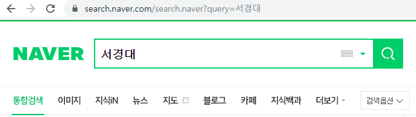
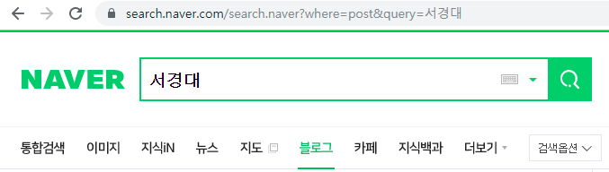
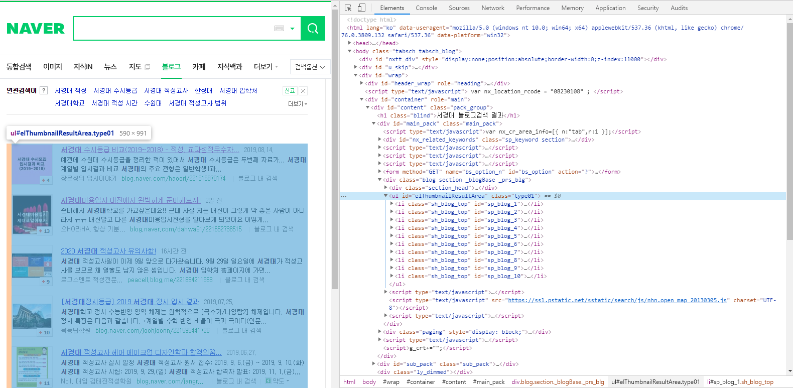
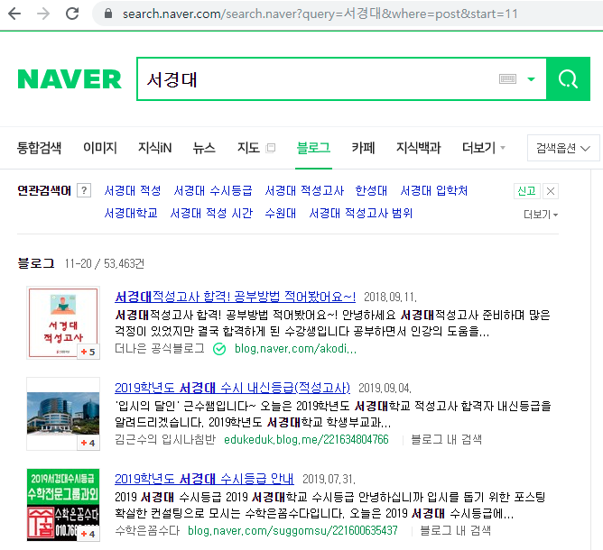

Naver Blog Crawling 수업자료 입니다. 

# 특정 검색어로 나오는 모든 블로그 포스트 크롤링 하기


### 1. Endpoint 찾기

먼저 운전을 해 목적지 까지 가야하는 상황을 생각해 봅시다. 만약 목적지가 처음 가는 길이라면 시동을 걸자마자 하는 일은 Navigation을 켜고 경로 검색을 하는 일이겠죠 ?

Web환경에서 크롤링 하는 일도 이와 같습니다. 먼저 얻고자 하는 웹페이지가 어떤 구조로 되어 있는지 살펴보기 전에 해당 웹페이지에 접근하는 일이 먼저겠죠.

도로에서는 00번 국도,00 대교 등등의 이름으로 경로를 구분해 운전자가 경로를 쉽게 찾아가도록 합니다. 

Web도 이와 마찬가지로, 어떤 서비스의 기능을 이용하고자 하는지에 대한 경로 이름이 모두 url에 매핑되어 있습니다. 

이를 Endpoint라 하는데, 기능에 대한 url 진입점이라고 생각 하시면 됩니다.

그러면 직접 네이버 블로그에서 검색을 해보고 url주소가 어떻게 바뀌고, 쿼리가 어떻게 매핑되어 전달되는지 알아보면 됩니다.

먼저 네이버에서 통합검색으로 '서경대'라는 키워드로 검색을 해봅니다.



url바를 보시면, 검색 기능은 search.naver.com/search.naver 에 할당 되어 있고, 검색키워드가 query=서경대 로 매핑되어 전달이 되는 것을 확인 하실수 있습니다.

블로그 포스트를 크롤링 하는 것이 목표이므로 블로그 탭에서 검색을 해본후 url을 살펴보면,




전과 같은 url에서 where=post 라는 항목이 추가 되어 있는 것을 보실 수 있습니다.

만약 해당 url로 자동으로 요청을 보낸후 결과 값을 받아 올수 만 있다면, 크롤링 프로그램을 매우 손 쉽게 짤 수 있을 것입니다.

### Python Library를 사용해 http 요청 보내기

결국 사용자가 네이버 검색창에서 키워드를 입력하고 결과를 가져오는 과정은 url에 알맞는 쿼리값을 주고 HTTP 요청을 보내는 일과 같다는 것을 앞서 살펴 보았습니다. 

파이썬에서 이러한 기능을 매우 손쉽게 처리해 주는 라이브러리가 있습니다.
파이썬 3.7 기본 내장 라이브러리인 urllib 모듈을 사용해 http 요청을 날려 보겠습니다.


```python
from urllib.request import urlopen
from bs4 import BeautifulSoup

url = "search.naver.com/search.naver?where=post&query={}"

def search(keyword) :
  _url = url.format(keyword)
  html = urlopen(_url)
  source = html.read()
  html.close()

  return BeautifulSoup(source,"html5lib")

```


### 검색된 포스트의 HTML 구조 파악 하기

python 라이브러리를 통하여 HTTP 요청을 보낸후 결과 값 까지 얻어오는데 성공했습니다.
그러면 결과 값을 분석해 필요한 데이터만 추출 하는 과정이 필요 하겠죠?

Web은 HTML구조로 데이터가 계층화되어 표현되어 있는것이 특징입니다. 데이터를 ID를 통해 찾을 수도 있고, Class 이름이나, 요소 아이템 형식으로도 찾아올 수있습니다.

네이버 검색 페이지에서 F12를 눌러 HTML 구조를 살펴 봅시다.



elThumbnailResultArea라는 아이디를 가지고 있는 ul 요소 안에 검색된 포스트들이 담겨 있는 모습을 확인 할 수 있습니다.

```python
def getPosts(keyword) :
  soup = search(keyword)
  return soup.find(id="sp_thmbthmb80")
```

ul요소 안에 링크된 url을 다시 HTTP 요청을 보낸다면 해당 블로그 페이지로 이동할 수 있겠죠?
또한 이 요청을 10개의 포스트 url에 대해서 반복 요청을 한후 결과 값을 파일로 저장하면 될 것 같습니다.

그리고 검색 결과는 53000 건인데 페이징 처리되어 10개 씩 보여주므로 페이지 이동 기능의 Endpoint 를 찾은 후, 다시 HTTP 요청을 보내는 작업을 다시한번 반복하면 모든 결과 포스트에 대해서 크롤링을 할 수 있을 겁니다. 

아래는 각 페이지의 url 주소를 가져오는 함수 입니다.

```python
def iteratePost(keyword) :
  posts = getPosts(keyword)

  def obj(post) :
    return post.find_all(class_="sp_thmbthmb80")[0].href

  return list( obj(post) for post in posts )
```


### 페이징 처리 구조 파악하기 

네이버는 어떻게 53000건이 넘는 포스트를 보여주고 순회하는 걸까요? 알아보기 위해 페이지를 넘겨보고, url 쿼리를 살펴봅시다.



페이지를 2로 이동했을때의 모습입니다. url 쿼리에서 start=11로 변경되있는 것을 확인 하실 수 있습니다.

여기서 11의 의미는 무엇일까요?

블로그 포스트가 10개씩 보여지고, 11-20/53463 이라고 표기되어 있는 페이징 상태값을 통해 start 파라미터는 블로그 포스트의 시작 offset이라는 것을 쉽게 알아 차리실 수 있을 것입니다.

그렇다면 이 값을 바꿔가며 HTTP요청을 날린다면, 페이징을 자동으로 순회하여 포스트들에 접근 할 수 있겠죠?

### 블로그 포스트의 글내용 추출하기


